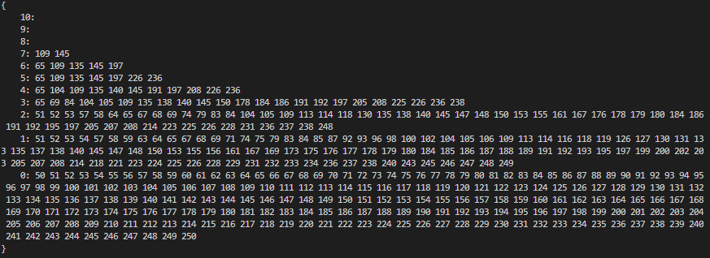

# Project Name
> An implementation of a lock-free and fine grained skiplist

## Table of Contents
* [General Info](#general-information)
* [Screenshots](#screenshots)
* [Setup](#setup)
* [Usage](#usage)
* [Room for Improvement](#room-for-improvement)
* [Acknowledgements](#acknowledgements)

## General Information
- The fine grained implementation has a reentrant lock attached to every node
- The lock-free implementation uses atomicMarkableReferences for every node
- Both of the implementations require the max height to be defined at initialization to reduce contention
- Created by William Anderson, Ameil Kumar, Alex Ali, and Jorge Lopez for Multicore Computing

## Screenshots

<!-- If you have screenshots you'd like to share, include them here. -->

## Setup
Any enviroment capable of running Java 8 can use this project.

## Usage
First decide the maximum height of your skiplist. A good rule of thumb for height is maxLevels = log(n) where n is an estimate for the maximum amount of nodes the list will have. Use log base 2.

Both of the lists extend abstract sets so you can use them as the init.

To initalize a lock-free list:

`AbstractSet<Integer> list = new LockFreeSkipList(maxLevel);`

To initalize a fine grained list:

`AbstractSet<Integer> list = new FineGrainedSkipList(maxLevel);`

## Room for Improvement

Room for improvement:
- Have a starting height then allow for max height to scale as neccesary
- Skiplist interface with a base row toString and a stringify that shows levels

## Acknowledgements
- The article http://www.cs.tau.ac.il/~shanir/nir-pubs-web/Papers/OPODIS2006-BA.pdf was looked at before the Fine Grained implementation was created.

